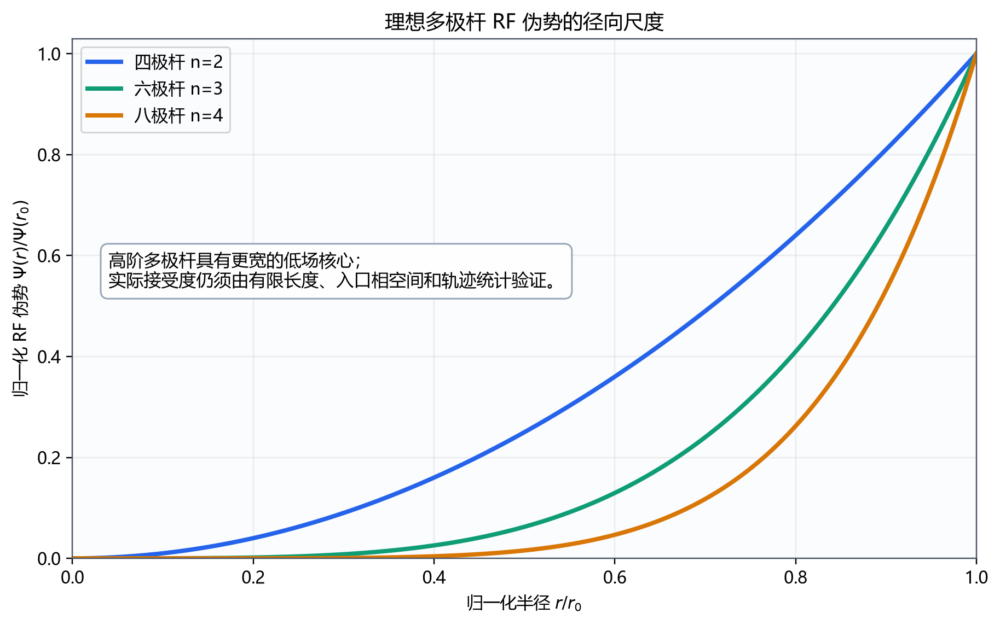

# 六极杆、八极杆与高阶多极杆

> **知识卡**：`document_id=multipoles.higher_orders` · `version=0.1.0` · `maturity=provisional` · `role=cross_project_design_family_knowledge`

本文件讨论 $n\ge3$ 的理想 $2n$ 极杆，重点是六极杆和八极杆。公共电压、坐标、伪势与绝热性定义见[共同理论](foundations.md)；缓冲气体环境见[碰撞与模型](collisions.md)。

> **重要**
>
> 六极杆和八极杆的横向力是非线性的，不存在可直接替代时域轨迹的标准四极 Mathieu 稳定图。伪势和绝热性适合早期筛选，正式接受度、传输、碰撞能量和触杆损失必须通过直接轨迹求解。

## 1. 一般 $2n$ 极模型

采用一个相位组相对地 RF 零到峰值 $V$，理想 RF-only 势为：

$$
\Phi_n(r,\theta,t)
=
V\cos(\Omega t+\phi)
\left(\frac r{r_0}\right)^n
\cos[n(\theta-\theta_0)].
$$

电场幅值包络、伪势和绝热性分别为：

$$
E_{\mathrm{amp},n}(r)
=
\frac{nV}{r_0}
\left(\frac r{r_0}\right)^{n-1},
$$

$$
\Psi_n(r)
=
\frac{Q^2n^2V^2}{4m\Omega^2r_0^2}
\left(\frac r{r_0}\right)^{2n-2},
$$

$$
\eta_n(r)
=
\frac{2|Q|n(n-1)V}{m\Omega^2r_0^2}
\left(\frac r{r_0}\right)^{n-2}.
$$

对 $n>2$：

- 中心区场和伪势更平坦；
- 恢复力在中心附近更弱，慢运动频率依赖振幅和能量；
- 靠近电极时场、伪势梯度和绝热性迅速增大；
- 有效约束边界同时受机械孔径、伪势深度和绝热性限制。



*四极、六极和八极 RF 伪势的径向标度。高阶多极杆形成更宽的低场核心，但中心恢复力也更弱。*

## 2. 六极杆

六极杆有六根交替极性的电极，对应 $n=3$：

$$
\Phi_3(x,y,t)
=
\frac{W(t)}{r_0^3}(x^3-3xy^2).
$$

横向电场为：

$$
\begin{aligned}
E_x&=-\frac{3W(t)}{r_0^3}(x^2-y^2),\\
E_y&=+\frac{6W(t)}{r_0^3}xy.
\end{aligned}
$$

RF-only 伪势为：

$$
\Psi_3(r)
=
\frac{9Q^2V^2}{4m\Omega^2r_0^2}
\left(\frac r{r_0}\right)^4.
$$

平均恢复力 $F_{r,\mathrm{eff}}\propto-r^3$。六极杆中心附近没有固定的简谐慢运动频率；粒子振幅越大，平均恢复越强。

### 2.1 工程特性

六极杆常用于 RF-only 离子传输、带缓冲气体的冷却或反应区域，以及需要较宽低场核心但又希望外侧约束早于八极杆增强的场景。

主要风险：中心恢复力弱、低能粒子横向振幅可能较大；空间电荷或入口偏心可把离子推向高场区域；外层碰撞的瞬时微运动能量可能显著；端部和 DC 偏置容易破坏六重对称性。

## 3. 八极杆

八极杆有八根交替极性的电极，对应 $n=4$：

$$
\Phi_4(x,y,t)
=
\frac{W(t)}{r_0^4}(x^4-6x^2y^2+y^4).
$$

横向电场为：

$$
\begin{aligned}
E_x&=-\frac{4W(t)}{r_0^4}(x^3-3xy^2),\\
E_y&=+\frac{4W(t)}{r_0^4}(3x^2y-y^3).
\end{aligned}
$$

RF-only 伪势为：

$$
\Psi_4(r)
=
\frac{4Q^2V^2}{m\Omega^2r_0^2}
\left(\frac r{r_0}\right)^6.
$$

平均恢复力 $F_{r,\mathrm{eff}}\propto-r^5$。中心区比六极杆更平坦，外侧壁更陡，但低能粒子在中心区的恢复更弱。

### 3.1 工程特性

八极杆常适合大低场核心的 RF-only 导向器、碰撞池、反应池和离子累积区域。主要风险是低场核心中的云团可能较大并对空间电荷更敏感；入口失配会把粒子直接送入高场外层；制造和幅相误差可能形成局部低势垒泄漏通道。

## 4. 四极、六极与八极杆比较

| 特性 | 四极杆 $n=2$ | 六极杆 $n=3$ | 八极杆 $n=4$ |
|---|---|---|---|
| 近轴电场 | $E\propto r$ | $E\propto r^2$ | $E\propto r^3$ |
| 伪势 | $\Psi\propto r^2$ | $\Psi\propto r^4$ | $\Psi\propto r^6$ |
| 中心恢复力 | 线性、最强 | 较弱、非线性 | 最弱、非线性 |
| 慢运动频率 | 低 $q$ 时近似固定 | 随振幅/能量变化 | 变化更强 |
| 标准 Mathieu 图 | 可用 | 不可直接用 | 不可直接用 |
| 典型功能 | 质量过滤、RF 导向 | RF 导向、冷却/反应 | 大低场核心、冷却/反应/累积 |
| 空间电荷敏感性 | 云团通常较集中 | 中等 | 低场核心中可能更明显 |
| 外侧绝热性压力 | 相对均匀 | 随 $r$ 增长 | 随 $r^2$ 增长 |

> **说明**
>
> “阶数越高越好”不是有效设计规则。器件选择取决于入口相空间、目标传输、气体压力、允许 RF 电压、空间电荷、机械孔径和接口条件。

## 5. 伪势深度、可用半径与接受度

若只在特征半径 $r_b$ 处比较理想伪势：

$$
\Psi_n(r_b)
=
\frac{Q^2n^2V^2}{4m\Omega^2r_0^2}
\left(\frac{r_b}{r_0}\right)^{2n-2}.
$$

实际可用区域应同时满足：不进入电极或支撑件；局部绝热性低于项目上限；伪势高于入口横向能量、空间电荷势和扰动；三维边缘场不形成更低泄漏势垒；寄生多极分量仍可接受。

建议定义：

$$
r_{\mathrm{usable}}
=
\min(r_{\mathrm{mechanical}},r_{\mathrm{adiabatic}},r_{\mathrm{field\ quality}},r_{\mathrm{trajectory}}).
$$

接受度必须由给定入口相空间、RF 相位、有限长度和接口场的粒子统计得到，不能只由伪势深度推断。

## 6. 多极阶数选择

| 需求特征 | 优先评估的阶数 | 原因 |
|---|---|---|
| 窄带质量筛选 | 四极杆 | 线性 Mathieu 稳定区形成质量通带 |
| 高真空 RF-only 传输，希望强中心聚焦 | 四极杆 | 中心恢复力线性且较强 |
| 碰撞冷却，需要较宽低场区 | 六极或八极 | 中心 RF 场较弱、外侧约束增强 |
| 较大离子云或反应体积 | 八极或更高阶 | 低场核心更宽 |
| 高空间电荷且需限制云团半径 | 四极或六极优先比较 | 更强中心恢复可能有利 |
| 对高场碰撞能量敏感 | 高阶可作候选，但必须控制外层占据 | 中心低场有利，外侧微运动可能更高 |

自动设计器可按以下顺序筛选：

1. 对 $n=2,3,4$ 在统一 $r_0,V,f,Q/m$ 下计算伪势与绝热性曲线；
2. 用入口横向能量和目标束斑估算最低势垒；
3. 施加最大电压、表面场、包络和机械公差约束；
4. 对保留候选生成真实圆杆二维场并拟合寄生项；
5. 加入三维端部和固定粒子表执行时域轨迹；
6. 有气体时加入已批准碰撞模型；
7. 以传输、出口相空间、能量、良率和功耗做 Pareto 排序。

## 7. 真实圆杆几何与场质量

理想六极和八极电极边界不是圆。实际设计需要参数化圆杆半径和中心半径、邻杆最小间隙、接地外壳、支撑介质、杆端倒角、分段缝隙和各电极幅相误差。

不存在可跨所有结构硬编码的圆杆半径比。目标函数至少包含：

$$
J_{\mathrm{field}}
=
w_0\epsilon_{\mathrm{target}}
+\sum_{k\ne n}w_k\left|\frac{A_k}{A_n}\right|^2
+w_E\left(\frac{E_{\mathrm{surface,max}}}{E_{\mathrm{limit}}}\right)^2.
$$

最终优化仍应由轨迹 KPI 驱动，而非只最小化某一个寄生系数。

## 8. 端部、分段与接口匹配

高阶多极杆中心场弱，入口偏心和边缘场可能比无限长截面性质更重要。三维模型应包含上游到本部件的坐标变换、粒子位置/速度/时间/RF 相位、RF 幅值爬升或相位连续性、分段 DC 梯度、下游孔径以及压力和气流的轴向分布。

同一机械硬件只改变 RF 幅值、频率、气体或运行目的时，使用不同 mode；电极数量、拓扑、正式 CAD 和验收合同需要长期独立维护时，建立新的平级项目。

## 9. 碰撞环境中的高阶多极杆

六极和八极杆经常用于碰撞冷却，但“高阶 + 气体 = 自动冷却”是不完整的。结果取决于气体状态、离子质量与初始能量、截面、RF 微运动、空间电荷、驻留时间和出口轴向场。

高阶多极杆中心场低，可降低中心区微运动；但粒子一旦进入外层，场和绝热性增长很快，碰撞可能把 RF 能量耦合进慢运动。必须按[碰撞与模型](collisions.md)选择 C0–C4 模型并通过零压力极限和冷却/加热对照测试。

## 10. 数值方法

解析和伪势初筛用于检查 Laplace 方程、对称性、径向尺度、目标半径处势垒、绝热性半径和表面场。

正式轨迹应积分：

$$
m\ddot{\mathbf r}
=Q\sum_iV_i(t)\mathbf E_i^{(1\mathrm V)}(\mathbf r)
+\mathbf F_{\mathrm{collision}}
+\mathbf F_{\mathrm{space\ charge}}.
$$

必须包含入口、通过、触及每根电极、支撑或孔径、返回入口、超时和反应终止事件。高阶多极杆还应增加振幅—慢运动频率关系、Poincaré 截面、初始半径/角度/RF 相位传输地图、绝热性超限位置、微运动能量和外层驻留比例。

## 11. 参考测试

| 测试 ID | 六极期望 | 八极期望 | 判据 |
|---|---|---|---|
| `hmp.potential.axes.v1` | $y=0$ 时 $\Phi\propto x^3$ | $\Phi\propto x^4$ | 解析一致 |
| `hmp.angular_periodicity.v1` | 旋转 $\pi/3$ 电势反号 | 旋转 $\pi/4$ 电势反号 | 相对误差 $<10^{-12}$ |
| `hmp.field_scaling.v1` | $E(\lambda r)=\lambda^2E(r)$ | $E(\lambda r)=\lambda^3E(r)$ | 相对误差 $<10^{-10}$ |
| `hmp.pseudopotential_scaling.v1` | $\Psi\propto r^4$ | $\Psi\propto r^6$ | 相对误差 $<10^{-10}$ |
| `hmp.adiabaticity_scaling.v1` | $\eta\propto r$ | $\eta\propto r^2$ | 相对误差 $<10^{-10}$ |
| `hmp.zero_rf.v1` | 直线运动 | 直线运动 | 步长收敛 |
| `hmp.field_independent_impl.v1` | 目标区域电势/场一致 | 同左 | 项目合同阈值 |
| `hmp.trajectory_convergence.v1` | 传输、能量、损失位置收敛 | 同左 | 步长/网格/样本收敛 |

## 12. 新项目的示意绑定

六极杆或八极杆形成正式设计线时，建议建立平级项目：

```text
projects/rf_hexapole_ion_guide/
projects/rf_octopole_collision_cell/
```

以下只是展示理论选择与项目参数分离的示例，不定义新的仓库合同或必建文件：

```json
{
  "theory_package": "multipoles@0.1.0",
  "component_type": "octopole",
  "electrode_count": 8,
  "radial_order_n": 4,
  "field_model": "octopole.round_rods.finite_length.v1",
  "trajectory_model": "rf_phase_resolved.time_domain.v1",
  "collision_model": "elastic_mcc.energy_dependent.v1",
  "model_level": "L4",
  "required_reference_tests": [
    "hmp.field_scaling.v1",
    "hmp.pseudopotential_scaling.v1",
    "collision.zero_pressure_limit.v1"
  ]
}
```

几何、电压、粒子源和气体参数仍由项目 `config/` 管理，不应写入本理论文件。

## 13. 参考资料

1. D. Gerlich, “Inhomogeneous RF Fields: A Versatile Tool for the Study of Processes with Slow Ions,” *Advances in Chemical Physics* 82, 1–176 (1992), [DOI 10.1002/9780470141397.ch1](https://doi.org/10.1002/9780470141397.ch1).
2. I. Szabo, “New ion-optical devices utilizing oscillatory electric fields. I. Principle of operation and analytical theory of multipole devices with two dimensional fields,” *International Journal of Mass Spectrometry and Ion Processes* 73, 197–235 (1986), [DOI 10.1016/0168-1176(86)80001-5](https://doi.org/10.1016/0168-1176(86)80001-5).
3. A. V. Tolmachev, H. R. Udseth, and R. D. Smith, “Radial stratification of ions as a function of mass to charge ratio in collisional cooling radio frequency multipoles used as ion guides or ion traps,” *Rapid Communications in Mass Spectrometry* 14, 1907–1913 (2000), [DOI 10.1002/1097-0231(20001030)14:20<1907::AID-RCM111>3.0.CO;2-M](https://doi.org/10.1002/1097-0231%2820001030%2914%3A20%3C1907%3A%3AAID-RCM111%3E3.0.CO%3B2-M).
