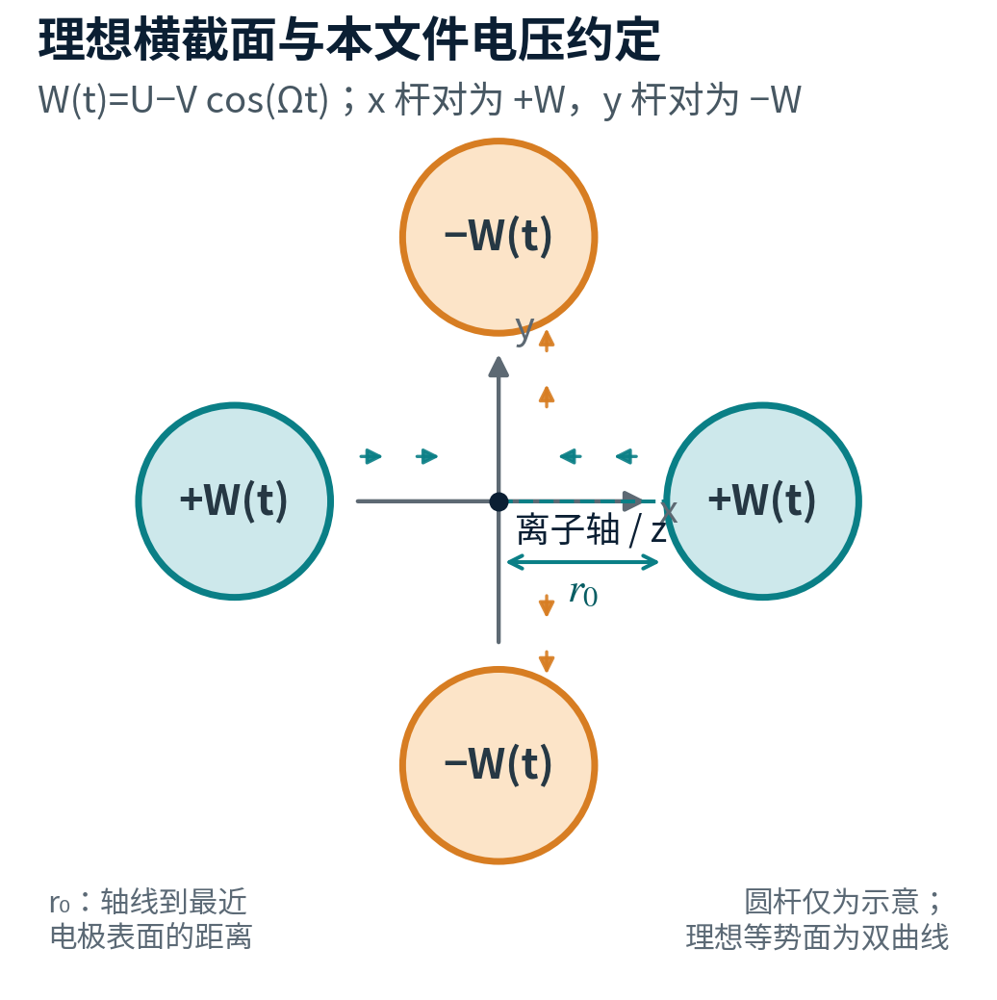
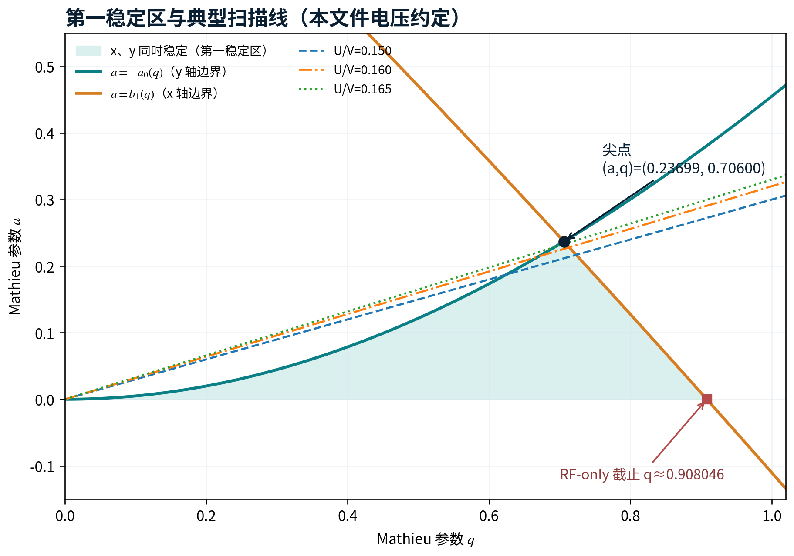
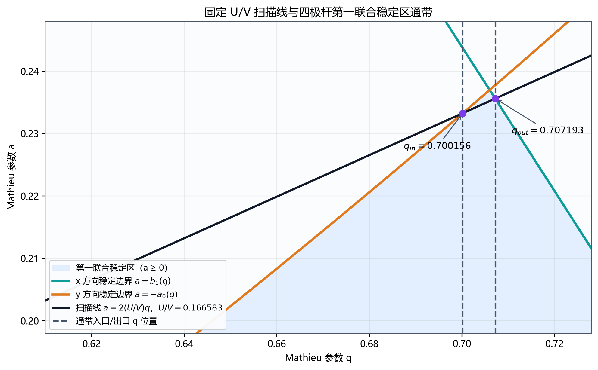
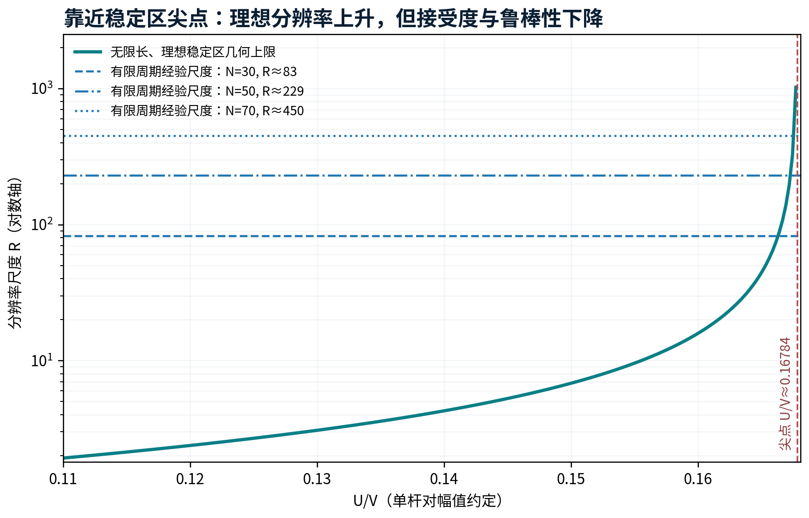
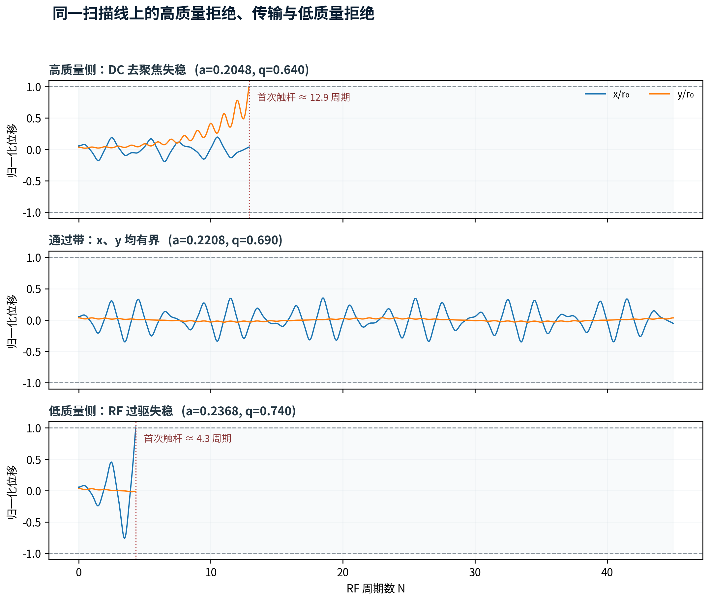
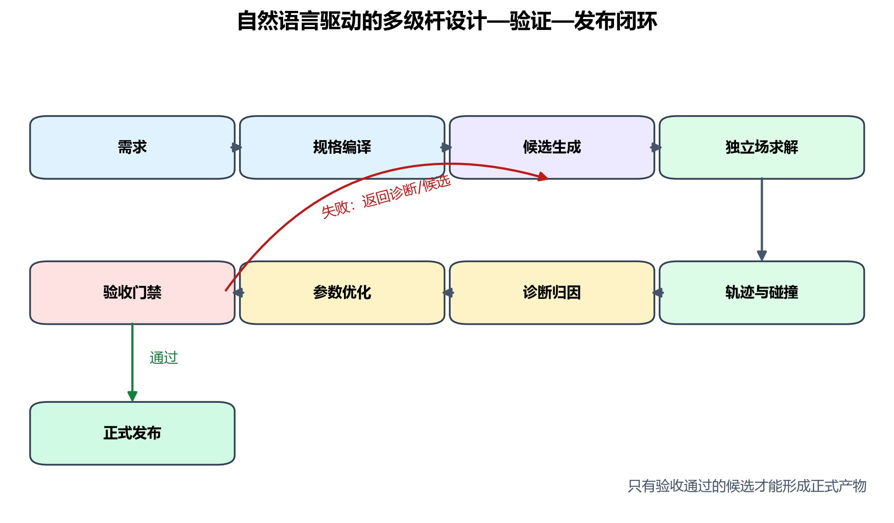

# 四极杆理论、质量筛选与可验证设计

> **知识卡**：`document_id=multipoles.quadrupole` · `version=0.1.0` · `maturity=provisional` · `role=cross_project_design_family_knowledge`

本文件覆盖线性四极质量过滤器和 RF-only 四极离子导向器。公共坐标、电压、伪势与模型层级以[共同理论](foundations.md)为准；有气体时还必须读取[碰撞与模型](collisions.md)。

> **警告**
>
> 标准 Mathieu 方程只适用于理想线性四极场，或经过验证可在目标区域近似为线性四极场的模型。六极杆、八极杆不能直接复用本文件的 $a$–$q$ 稳定图。

## 1. 器件、坐标与电压约定

四根平行电极沿 $z$ 轴延伸。相对的两根 $x$ 电极构成一个相位组，相对的两根 $y$ 电极构成另一个相位组。本文取：

$$
W(t)=U-V\cos(\Omega t),\qquad \Omega=2\pi f,
$$

$x$ 电极组施加 $+W(t)$，$y$ 电极组施加 $-W(t)$。$U$ 和 $V$ 都是一个相位组相对地的幅值，$V$ 为零到峰值。

*四极杆横截面、坐标和本文电压约定。$r_0$ 是轴线到最近理想电极表面的距离。*

| 输入方式 | 与本文 $U,V$ 的关系 |
|---|---|
| 两相位组 DC 差值 | $U=\Delta V_{\mathrm{DC,diff}}/2$ |
| 两相位组 RF 零到峰值 | $V=V_{\mathrm{RF,diff,0pk}}/2$ |
| 两相位组 RF 峰峰值 | $V=V_{\mathrm{RF,diff,pp}}/4$ |
| 文献写作 $\pm[U'-V'\cos\Omega t]/2$ | $U=U'/2$、$V=V'/2$ |

## 2. 理想四极势与电极几何

理想二维四极势为：

$$
\Phi(x,y,t)=W(t)\frac{x^2-y^2}{r_0^2}.
$$

电场分量为：

$$
E_x=-\frac{2W(t)}{r_0^2}x,
\qquad
E_y=+\frac{2W(t)}{r_0^2}y.
$$

理想双曲电极表面满足：

$$
x^2-y^2=+r_0^2\quad(x\text{ 电极}),
\qquad
x^2-y^2=-r_0^2\quad(y\text{ 电极}).
$$

某一瞬间一个方向聚焦、另一个方向去聚焦；半个 RF 周期后交换。稳定来自交替聚焦，不是任意时刻的静态二维势阱。

工程上常用圆柱杆。圆杆易加工，但不再是理想势的精确等势面，会产生高阶空间谐波。常见的 $r_e/r_0\approx1.145$–$1.148$ 只能作为理想二维圆杆的初始值，不能替代完整外壳、支撑、端部和公差优化。

## 3. 从牛顿方程到 Mathieu 方程

令离子质量为 $m$、带符号电荷为 $Q$。理想场中：

$$
m\ddot x+\frac{2QW(t)}{r_0^2}x=0,
$$

$$
m\ddot y-\frac{2QW(t)}{r_0^2}y=0.
$$

定义无量纲时间：

$$
\xi=\frac{\Omega t}{2}.
$$

一个 RF 周期对应 $\Delta\xi=\pi$。两方向均化为标准 Mathieu 方程：

$$
\frac{\mathrm d^2u}{\mathrm d\xi^2}
+\left[a_u-2q_u\cos(2\xi)\right]u=0.
$$

在本文电压约定下：

$$
a_x=-a_y=\frac{8QU}{mr_0^2\Omega^2},
\qquad
q_x=-q_y=\frac{4QV}{mr_0^2\Omega^2}.
$$

$q$ 的符号反转等价于 RF 相位平移半个周期，因此稳定图常使用 $|q|$；$a$ 的正负对应两个横向方向的 DC 聚焦与去聚焦，不能丢失。

## 4. Floquet 解、微运动与伪势

Mathieu 方程系数对 $\xi$ 的周期为 $\pi$。Floquet 解可写成：

$$
u(\xi)=\exp(i\beta\xi)P(\xi),
\qquad
P(\xi+\pi)=P(\xi).
$$

当特征指数 $\beta$ 为实数并且不位于退化边界时，解有界。低 $q$ 时可把运动理解为慢宏运动叠加 RF 微运动：

$$
\beta\approx\sqrt{a+\frac{q^2}{2}},
\qquad
\omega_{\mathrm{sec}}=\frac{\beta\Omega}{2}.
$$

RF-only 且 $|q|\ll1$ 时：

$$
\omega_{\mathrm{sec}}\approx\frac{|q|\Omega}{2\sqrt2}.
$$

四极场伪势为：

$$
\Psi_{\mathrm{qmf}}(x,y)
=
\frac{Q^2V^2}{m\Omega^2r_0^4}(x^2+y^2).
$$

接近第一稳定区尖点时 $q\approx0.706$，已不属于很小 $q$。高分辨率质量过滤器不能以伪势代替完整 Mathieu/Floquet 或时域轨迹。

## 5. 第一稳定区

单轴 Mathieu 方程的第一稳定带满足：

$$
a_0(q)<a<b_1(q),
$$

其中 $a_0(q)$ 和 $b_1(q)$ 是 Mathieu 特征值。四极质量过滤要求 $x$、$y$ 两个方向同时稳定。在第一象限 $a\ge0,q\ge0$ 中：

$$
0\le a\le\min[-a_0(q),b_1(q)].
$$

*第一稳定区、RF-only 截止和典型固定 $U/V$ 扫描线。图中数值采用本文电压约定。*

| 量 | 数值 | 工程意义 |
|---|---:|---|
| 第一稳定区尖点 | $a\approx0.236994$，$q\approx0.705996$ | 理论窄带扫描线极限接触点 |
| 尖点 $U/V$ | $a/(2q)\approx0.167844$ | 再提高 DC/RF 比将失去第一稳定区交集 |
| RF-only 截止 | $a=0$，$q\approx0.908046$ | 理想 RF-only 四极导向器低质量截止 |
| 工作线斜率 | $a/q=2U/V$ | 固定 $U/V$ 时不同 $m/z$ 位于同一射线 |

### 5.1 单周期传递矩阵判据

不依赖内置 Mathieu 特征函数时，可对两个线性独立初值积分一个系数周期 $\pi$，构造基本矩阵：

$$
M=
\begin{bmatrix}
u_1(\pi)&u_2(\pi)\\
u_1'(\pi)&u_2'(\pi)
\end{bmatrix}.
$$

无阻尼理想方程满足 $\det M=1$。Floquet 稳定判据为：

$$
|\operatorname{Tr}M|<2\Rightarrow\text{稳定},\quad
|\operatorname{Tr}M|=2\Rightarrow\text{边界},\quad
|\operatorname{Tr}M|>2\Rightarrow\text{失稳}.
$$

主实现可使用 Mathieu 特征值，独立实现使用单周期矩阵；二者不应共享同一算法路径。

### 5.2 稳定不等于传输

Floquet 稳定只说明无限时间线性解不指数发散。真实离子还必须满足：

- 在有限孔径中不触杆；
- 能穿过入口与出口边缘场；
- 对入口位置、角度、能量和 RF 相位具有足够接受度；
- 在有限杆长内完成足够质量判别；
- 对圆杆谐波、幅相误差和机械公差仍满足验收。

报告中应明确写“Mathieu 稳定”或“在给定入口分布下传输”，不得把二者合并为含糊的“稳定通过”。

## 6. 固定 $U/V$ 扫描线与质量筛选

对固定 $U,V,r_0,\Omega$，不同质荷比只改变 $a,q$ 的共同尺度：

$$
\frac{a}{q}=\frac{2U}{V}.
$$

沿工作线 $q\propto1/\mu$。高质量离子靠近原点，低质量离子位于更大的 $q$。固定正斜率工作线与第一稳定区相交形成有限通带，因此 RF+DC 四极杆可作带通质量过滤器。

RF-only 时 $U=0$，工作线沿 $a=0$ 轴。足够低的 $m/z$ 因 $q>0.908046$ 失稳，而更高 $m/z$ 可稳定，因此理想 RF-only 四极杆表现为低质量截止的高通导向器，不是窄带质量过滤器。

*固定 $U/V$ 扫描线与稳定区的两个交点形成理想质量通过带。由于 $q\propto1/\mu$，质量方向与 $q$ 方向相反。*

## 7. 质量尺度

令 $z>0$ 为电荷态绝对值、$Q=sze$。对给定极性取稳定参数幅值，将 $m=\mu zu$、$|Q|=ze$ 代入 $|q|$，电荷态消去：

$$
|q|=\frac{4eV}{\mu u r_0^2\Omega^2}.
$$

使用 $r_0$ 的 mm、$f$ 的 MHz 和本文的 $V$ 定义：

$$
\mu\,[\mathrm{Th}]
=
9.776008\,
\frac{V\,[\mathrm V]}
{q_{\mathrm{cal}}\,r_0[\mathrm{mm}]^2\,f[\mathrm{MHz}]^2}.
$$

> **重要**
>
> 上式中的 $V$ 是一个相位组相对地的 RF 零到峰值。若控制器给出两相位组之间的差分峰峰值，必须先除以 4。

## 8. 理想通带和稳定区分辨率

定义工作线斜率 $s=2U/V$。工作线与两条边界的交点满足：

$$
sq_{\mathrm{in}}=-a_0(q_{\mathrm{in}}),
\qquad
sq_{\mathrm{out}}=b_1(q_{\mathrm{out}}).
$$

令 $C=4eV/(ur_0^2\Omega^2)$。高质量和低质量边界为：

$$
\mu_{\mathrm{high}}=\frac{C}{q_{\mathrm{in}}},
\qquad
\mu_{\mathrm{low}}=\frac{C}{q_{\mathrm{out}}}.
$$

若标称质量定义为两个边界质量的算术中心，则：

$$
R_{\mathrm{stab}}
=
\frac{\mu_c}{\Delta\mu}
=
\frac{q_{\mathrm{in}}+q_{\mathrm{out}}}
{2(q_{\mathrm{out}}-q_{\mathrm{in}})}.
$$

相应的有效 $q$ 为谐均值：

$$
q_{\mathrm{cal}}
=
\frac{2q_{\mathrm{in}}q_{\mathrm{out}}}
{q_{\mathrm{in}}+q_{\mathrm{out}}}.
$$

| $U/V$ | $q_{\mathrm{in}}$ | $q_{\mathrm{out}}$ | $q_{\mathrm{cal}}$ | $R_{\mathrm{stab}}$ |
|---:|---:|---:|---:|---:|
| 0.1500 | 0.624486 | 0.723301 | 0.670271 | 6.8 |
| 0.1600 | 0.669866 | 0.713504 | 0.690997 | 15.9 |
| 0.1650 | 0.692841 | 0.708701 | 0.700681 | 44.2 |
| 0.1670 | 0.702086 | 0.706796 | 0.704433 | 149.6 |
| 0.1675 | 0.704403 | 0.706322 | 0.705361 | 367.5 |

$U/V$ 趋近尖点比值时，理想 $R_{\mathrm{stab}}$ 数学上迅速增大，但通带宽度和接受相空间趋近于零。工程目标不应是“最大化 $U/V$”，而应是在最低透过率、峰形、公差和高压约束下满足目标分辨率。

## 9. 实际分辨率、有限长度与透过率

### 9.1 峰宽定义

质量分辨率必须带峰宽定义：

$$
R_w=\frac{\mu_{\mathrm{peak}}}{\Delta\mu_w}.
$$

其中 $w$ 可为 FWHM、10% 峰高宽、5% 峰高宽或双峰谷值准则。不同定义不能直接比较。验收合同至少保存峰中心算法、基线算法、扫描步长、平滑规则、置信水平和最小传输率。

### 9.2 RF 周期数

有效杆长为 $L$、平均轴向速度为 $v_z$ 时：

$$
N=\frac{fL}{v_z}.
$$

若离子由每电荷 $V_{\mathrm{acc}}$ 的轴向电位差加速，忽略初始能量散布：

$$
v_z
=
\sqrt{\frac{2|Q|V_{\mathrm{acc}}}{m}}
=
\sqrt{\frac{2eV_{\mathrm{acc}}}{\mu u}}.
$$

工程单位形式：

$$
N\approx0.071987\,
f[\mathrm{MHz}]L[\mathrm{mm}]
\sqrt{\frac{\mu[\mathrm{Th}]}{V_{\mathrm{acc}}[\mathrm V]}}.
$$

一类 von Zahn 型经验关系写成：

$$
R_{\mathrm{time}}\approx\frac{N^2}{h},
$$

其中系数 $h$ 随稳定区、工作点、入口条件和峰宽定义变化；第一稳定区工程估算常见量级约为 10–20。本文参考图和算例取 $h=10.9$，只用于早期淘汰明显过短或过快的候选。正式分辨率必须由质量扫描峰得到。

*理想稳定区几何分辨率与有限 RF 周期筛选尺度。图中有限时间曲线采用参考系数 $h=10.9$；设计器应同时计算两类约束，并以更严格者筛选候选。*

### 9.3 入口相空间与 RF 相位

最小粒子初值至少包括：

$$
(x,y,v_x,v_y,v_z,\phi_{\mathrm{RF}}).
$$

如有能量散布、时间结构、碰撞或空间电荷，还需扩展维度。$x$、$y$ 两个相平面由共同 RF 相位耦合，严格接受度是随入口相位变化的四维横向相空间体积，不是两个独立二维椭圆的简单乘积。

*同一工作线上三个典型质量位置的理想轨迹。轨迹是否通过还取决于初始位置、角度、相位和有限孔径。*

禁止只用轴线单粒子报告透过率。最低合格样本应覆盖入口孔径、角度或发射度、能量分布和均匀 RF 相位，并保存随机种子和粒子表哈希。

### 9.4 分辨率—透过率—鲁棒性权衡

| 调节量 | 对分辨率的常见影响 | 对透过率/鲁棒性的常见影响 | 联动检查 |
|---|---|---|---|
| 提高 $U/V$ | 缩窄理想稳定通带 | 接受度下降、幅相和几何误差放大 | 峰高、尾峰、质量漂移、公差良率 |
| 增加 $L$ 或 $f$ | 增加 RF 周期数 | 增加电容、驱动和直线度压力 | 功耗、热漂移、杆弯曲 |
| 降低轴向能量 | 增加驻留时间 | 可能增加入口反射、碰撞和空间电荷 | 入口透镜、压力、能散 |
| 缩小入口孔径 | 可改善相空间选择和峰形 | 绝对信号下降 | 离子源亮度与检测器动态范围 |

## 10. 圆杆场、谐波与制造误差

理想对称但非双曲的四极截面可展开为：

$$
\frac{\Phi(r,\theta,t)}{W(t)}
=
A_2\left(\frac r{r_{\mathrm{ref}}}\right)^2\cos2\theta
+A_6\left(\frac r{r_{\mathrm{ref}}}\right)^6\cos6\theta
+A_{10}\left(\frac r{r_{\mathrm{ref}}}\right)^{10}\cos10\theta+\cdots.
$$

$A_2$ 是目标四极项；$A_6$ 和 $A_{10}$ 会造成非线性恢复力、峰形不对称、质量偏移、卫星结构或拖尾。机械不对称还会引入偶极、六极及其他本应被理想对称性禁止的项。

### 10.1 误差族

| 误差族 | 参数化建议 | 主要观察量 |
|---|---|---|
| 杆位置与直线度 | 每根杆的 $\Delta x(z),\Delta y(z)$、倾角 | 峰位、峰宽、触杆方位和损失 $z$ 分布 |
| 杆半径与圆度 | $r_{e,i}$、椭圆度、粗糙度 | 高阶项、尾峰、局部表面场 |
| RF 幅值不平衡 | $V_x/V_y$、共模 RF | $x/y$ 接受度不对称、质量偏移 |
| RF 相位误差 | $\phi_x-\phi_y-\pi$ | 异常微运动、加热和峰形畸变 |
| DC 偏置/漂移 | 差模与共模 DC | 工作线斜率、中心轨道和质量标定 |

理想质量尺度的一阶误差可写为：

$$
\frac{\delta\mu}{\mu}
\approx
\frac{\delta V}{V}
-2\frac{\delta f}{f}
-2\frac{\delta r_0}{r_0}
-\frac{\delta q_{\mathrm{cal}}}{q_{\mathrm{cal}}}.
$$

$q_{\mathrm{cal}}$ 本身会随 $U/V$、圆杆谐波、边缘场和峰中心算法变化，因此高精度标定必须依靠完整峰模拟或实验校准。

## 11. 边缘场、孔径与预过滤杆

有限电极在入口和出口产生横向—轴向耦合场。离子从无 RF 区进入 RF+DC 主杆区时会经历非绝热注入；入口间隙、孔径、透镜电压、端部形状和 RF 相位都可能改变传输。

RF-only 预过滤杆可减小主质量过滤段 DC 边界带来的注入损失，但必须在三维模型中包含预杆长度和内切半径、预杆与主杆间隙、RF 幅值和相位连续性、主杆 DC 实际起始位置以及入口/出口孔径。

只要需求包含绝对透过率、峰尾、卫星峰、预杆、透镜、杆端倒角或机械支架，二维无限长模型就不足以支持这些结论，不论产物处于哪种生命周期。

## 12. 运行和扫描模式

| 模式 | 控制方式 | 适用目的 | 主要风险 |
|---|---|---|---|
| RF-only 传输 | $U=0$，固定或扫描 $V,f$ | 离子导向、低质量截止 | 入口相位、微运动、碰撞和边缘场 |
| 幅值比例质量扫描 | $U,V$ 同比例变化，$U/V$ 固定 | 经典线性质量扫描 | 峰宽和传输随质量变化 |
| 频率扫描 | 扫描 $f$，按规则调整电压 | 绕开部分高压限制 | 电路幅相频响必须进入模型 |
| 分段/自适应扫描 | 随质量改变 $U/V$、步长和驻留 | 恒定峰宽或透过率目标 | 必须经校准与闭环仿真 |
| 非正弦数字波形 | 方波、脉冲或任意周期 | 特殊稳定区或电源实现 | 须用 Hill/Floquet，不能查正弦 Mathieu 图 |

## 13. 设计流程

*多极杆生成式工程闭环。解析理论只负责早期筛选，正式发布需要独立场和轨迹验证。*

推荐顺序：

1. **规范编译**：消解质量范围、分辨率定义、电压参考、几何包络、接口平面和使用场景。
2. **L0 解析筛选**：计算 $a,q$、稳定区交点、质量尺度、表面场初值和 RF 周期数。
3. **参数化截面**：优化 $r_0,r_e$、中心距、外壳和支撑，拟合 $A_2,A_6,A_{10}$。
4. **三维场模型**：加入有限长度、端部、孔径、透镜和预/后置杆。
5. **时域轨迹**：固定粒子表，覆盖 RF 相位、入口相空间和质量扫描。
6. **诊断**：输出损失位置、杆编号、入口相位、峰形和场谐波。
7. **鲁棒性**：执行几何、电气和束流公差 Monte Carlo。
8. **独立验证**：解析边界对单周期矩阵，COMSOL 场对 SIMION 或独立参考实现。
9. **验收发布**：通过项目 Candidate/Formal 门禁后冻结 CAD、模型、结果、报告和哈希。

## 14. 理论和数值参考测试

| 测试 ID | 输入 | 期望值/性质 | 建议容差 |
|---|---|---|---|
| `qmf.mathieu.apex.v1` | 第一稳定区 | $a=0.236994,q=0.705996$ | $10^{-4}$ |
| `qmf.rf_only.cutoff.v1` | $a=0$ | $q=0.908046$ | $10^{-4}$ |
| `qmf.scanline.uv_0160.v1` | $U/V=0.160$ | $q_{in}\approx0.669866$、$q_{out}\approx0.713504$、$R\approx15.9$ | 0.1% |
| `qmf.monodromy.det.v1` | 稳定和失稳点 | $\det M\rightarrow1$ | 随步长收敛 |
| `qmf.mass_scale.v1` | 指定 $V,r_0,f,q$ | 复现质量尺度公式 | 相对误差 $10^{-10}$ |
| `qmf.zero_field.v1` | $U,V\rightarrow0$ | 直线运动 | 随步长收敛 |
| `qmf.phase_sampling.v1` | 均匀入口 RF 相位 | 统计指标随样本数收敛 | 项目合同定义 |
| `qmf.field_harmonics.v1` | 理想双曲场 | 除 $A_2$ 外寄生项趋零 | 网格收敛 |

项目特有的 FWHM、网格、样本量和独立验证阈值仍以根 `docs/VALIDATION_METHODS.md` 和项目分析合同为准；项目门禁明确要求跨求解器时，再将其作为强制条件。

## 15. 算例：100 Th、目标理想 $R=100$

输入：

| 输入 | 数值 |
|---|---:|
| 中心质荷比 | 100 Th |
| 目标 $R_{\mathrm{stab}}$ | 100 |
| $r_0$ | 4.000 mm |
| $f$ | 2.000 MHz |
| 有效杆长 $L$ | 150.0 mm |
| 轴向电位差 | 10.0 V/charge |

由稳定边界反求工作线：

| 派生量 | 数值 |
|---|---:|
| $U/V$ | 0.1665830 |
| $q_{\mathrm{in}}$ | 0.7001558 |
| $q_{\mathrm{out}}$ | 0.7071927 |
| $q_{\mathrm{cal}}$ | 0.7036566 |
| 复算 $R_{\mathrm{stab}}$ | 100.00 |

由质量尺度得到：

| 电压量 | 本文单相位组幅值 | 两相位组差分量 |
|---|---:|---:|
| RF | $V=460.659$ V 零到峰值 | 差分峰峰值约 1842.6 V |
| DC | $U=76.738$ V | 差分 DC 约 153.5 V |

有限时间初筛：

| 量 | 数值 |
|---|---:|
| RF 周期数 $N$ | 68.29 |
| 参考 $N^2/10.9$ | 427.9 |
| 初筛结论 | 理想稳定区 $R=100$ 比经验时间尺度更严格 |

这只证明候选未被 L0/L1 初筛淘汰。进入 Candidate 前仍需圆杆优化、完整三维场、固定入口粒子表、与目标结论相称的独立验证、峰形 FWHM、最低透过率和公差统计；是否必须跨求解器由项目门禁声明。

## 16. 与项目 mode 的绑定

| mode 类型 | 理论模型 | 碰撞模型 | 必须测试 |
|---|---|---|---|
| RF-only 无碰撞传输 | $a=0$ Mathieu + 有限长度时域轨迹 | `disabled` | RF-only 截止、相位采样、独立终点分布验证 |
| RF+DC 质量过滤 | 第一稳定区、工作线、质量扫描 | 通常先 `disabled` | 稳定区、质量标定、峰宽、透过率 |
| 碰撞冷却 | RF-only 时域场 + Monte Carlo 碰撞 | 明确 C1–C4 | 零压力极限、碰撞守恒、冷却/加热和统计收敛 |

现有 RF 四极杆项目入口为 [`projects/rf_quadrupole_collision_cooling/README.md`](../../projects/rf_quadrupole_collision_cooling/README.md)。该项目的几何、粒子源、mode 和接口仍由其 `config/` 单向派生，本文件不得成为第二参数源。

## 17. 参考资料

1. W. Paul, H. P. Reinhard, and U. von Zahn, “Das elektrische Massenfilter als Massenspektrometer und Isotopentrenner,” *Zeitschrift für Physik* 152, 143–182 (1958), [DOI 10.1007/BF01327353](https://doi.org/10.1007/BF01327353).
2. W. Paul, “Electromagnetic traps for charged and neutral particles,” *Reviews of Modern Physics* 62, 531–540 (1990), [DOI 10.1103/RevModPhys.62.531](https://doi.org/10.1103/RevModPhys.62.531).
3. D. J. Douglas, “Linear quadrupoles in mass spectrometry,” *Mass Spectrometry Reviews* 28, 937–960 (2009), [DOI 10.1002/mas.20249](https://doi.org/10.1002/mas.20249).
4. F. M. Ma and S. Taylor, “Simulation of ion trajectories through the mass filter of a quadrupole mass spectrometer,” *IEE Proceedings—Science, Measurement and Technology* 143, 71–76 (1996), [DOI 10.1049/ip-smt:19960128](https://doi.org/10.1049/ip-smt:19960128).
5. J. R. Gibson and S. Taylor, “Prediction of quadrupole mass filter performance for hyperbolic and circular cross section electrodes,” *Rapid Communications in Mass Spectrometry* 14, 1669–1673 (2000).
6. N. V. Konenkov, M. Sudakov, and D. J. Douglas, “Matrix methods for the calculation of stability diagrams in quadrupole mass spectrometry,” *Journal of the American Society for Mass Spectrometry* 13, 597–613 (2002), [DOI 10.1016/S1044-0305(02)00365-3](https://doi.org/10.1016/S1044-0305%2802%2900365-3).
